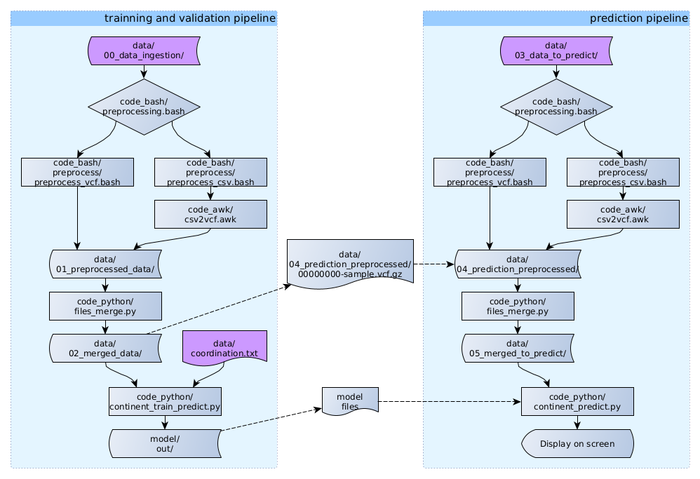

# amphora-challenge

The amphora challenge is a bioinformatics project to work on genomic information to classify each sample in its continent as a final objective.

The input data consists of two file formats, the first is vcf files which is a standardized file format used in genomics and the second is a raw format with a csv extension that represents genomic data that should be correctly processed before it can be merged with the rest of the data.

The final results consist of three tasks. The first is to merge all the input data into one table, the second is to create a clustering strategy and visualize the clusters, and the final task is to evaluate the clustering result.

## Programming languages

To solve this project we can use any programming language but is suggested to use python or R. Trying to use the best tools for each task I decided to use three programming languages which are Bash, awk, and python.

- Bash is a very useful tool for Linux environments that let me interact with all the command line tools available on the machine. The tools that I am mostly using from the command line are awk, file, sed, and sort and I decided to use them for the data preprocessing. I decided to link so hard my code to Linux computers because I can see in the vcf files that they were generated on an Ubuntu computer.

- Awk is a programming language designed for text processing line by line, so I decided to use this language to make the csv to vcf file conversion in an efficient way.

- Python is the recommended tool to solve this project, it was not my first option to solve the complete project because it has efficiency problems when there are involved buckles. On the other hand, the most important tools designed for machine learning are programmed to work with python, so, after the preprocessing the merge process, data clustering, and the evaluation were developed in this language.

- Makefile is not a programming language, but here are coded all the instructions needed to process the data with a single command.

## Installation

To run this code make command should be installed on the computer, this command can be installed whit the following code

```bash
sudo apt install make
```

After this command has been installed all the remaining pre-requisites can be checked with the command

```bash
make test
```

This command will check for all the required commands but will not install it, only will inform if there is a problem with the required command. I decided to keep this approach to be transparent in the list of packages required.

Most of the required packages are part of the standard Ubuntu installation except for pip (recommended but not required), python3, and file, which are not part of the docker's Ubuntu image but can be installed with

```bash
apt install pip python3 file
```

In terms of libraries required for python, they are matplotlib, numba, pandas, and sklearn. These libraries can be installed whit the command

```bash
pip install sklearn pandas matplotlib numba
```

After this point, you should have all the required packages to run this program.

## Usage

To run the program you should copy the complete dataset given for this project in the 'data/00_data_ingestion' folder, this dataset doesn't need a particular file structure, only copy all the files in the folder without the use of sub-folders. Now you will be able to use the command

```bash
make run
# the first execution may fail
make run
# but only the first and never again
```

this command will take care of the complete workflow which is specified in [model/README.md file](model/README.md). The first run will end showing an error because at the beginning the folder 'data/01_preprocessed_data' was empty, but the next execution will run without problems showing the final classification at the end of the process.

## Pipeline

A more detailed overview of the pipeline can be read in [model/README.md file](model/README.md).

A general map of the workflow is described in the next image, which describes how the input data moves around each folder using different scripts to receive, clean, transform, merge and process the data. The output of this process is stored in the folder "model/out/".




## Results

The complete description of the results are described in [model/README.md file](model/README.md)

## Contributing
Comments are welcome. This GitHub will not be updated after the coding test.

## License
Only for personal use
