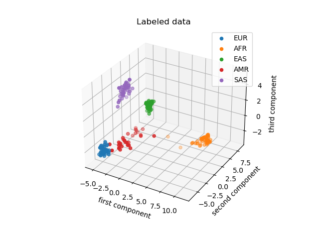
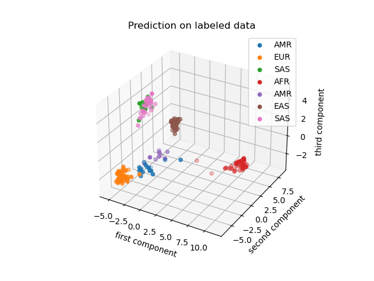
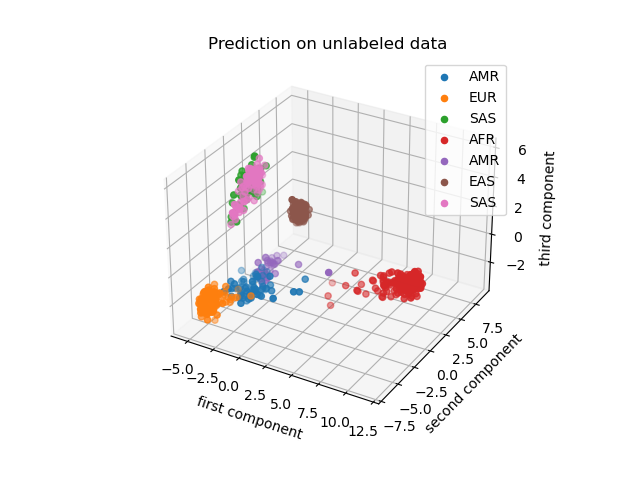
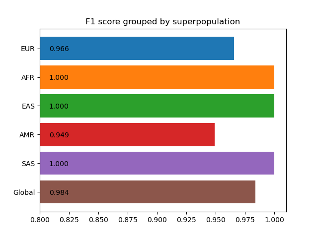

# amphora-challenge

The amphora challenge is a bioinformatics project to work on genomic information to classify each sample in its continent as a final objective.

The input data consists of two file formats, the first is vcf files which is a standardized file format used in genomics and the second is a raw format with a csv extension that represents genomic data that should be correctly processed before it can be merged with the rest of the data.

The final results consist of three tasks. The first is to merge all the input data into one table, the second is to create a clustering strategy and visualize the clusters, and the final task is to evaluate the clustering result.

## Programming languages

To solve this project we can use any programming language but is suggested to use python or R. Trying to use the best tools for each task I decided to use three programming languages which are Bash, awk, and python.

- Bash is a very useful tool for Linux environments that let me interact with all the command line tools available on the machine. The tools that I am mostly using from the command line are awk, file, sed, and sort and I decided to use them for the data preprocessing. I decided to link so hard my code to Linux computers because I can see in the vcf files that they were generated on an Ubuntu computer.

- Awk is a programming language designed for text processing line by line, so I decided to use this language to make the csv to vcf file conversion in an efficient way.

- Python is the recommended tool to solve this project, it was not my first option to solve the complete project because it has efficiency problems when there are involved buckles. On the other hand, the most important tools designed for machine learning are programmed to work with python, so, after the preprocessing the merge process, data clustering, and the evaluation were developed in this language.

- Makefile is not a programming language, but here are coded all the instructions needed to process the data with a single command.

## Installation

To run this code make command should be installed on the computer, this command can be installed whit the following code

```bash
sudo apt install make
```

After this command has been installed all the remaining pre-requisites can be checked with the command

```bash
make test
```

This command will check for all the required commands but will not install it, only will inform if there is a problem with the required command. I decided to keep this approach to be transparent in the list of packages required.

Most of the required packages are part of the standard Ubuntu installation except for pip (recommended but not required), python3, and file, which are not part of the docker's Ubuntu image but can be installed with

```bash
apt install pip python3 file
```

In terms of libraries required for python, they are matplotlib, numba, pandas, and sklearn. These libraries can be installed whit the command

```bash
pip install sklearn pandas matplotlib numba
```

After this point, you should have all the required packages to run this program.

## Usage

To run the program you should copy the complete dataset given for this project in the 'data/00_data_ingestion' folder, this dataset doesn't need a particular file structure, only copy all the files in the folder without the use of sub-folders. Now you will be able to use the command

```bash
make run
# the first execution may fail
make run
# but only the first and never again
```

this command will take care of the complete workflow which is specified in [model/README.md file](model/README.md). The first run will end showing an error because at the beginning the folder 'data/01_preprocessed_data' was empty, but the next execution will run without problems showing the final classification at the end of the process.

## Pipeline

A more detailed overview of the pipeline can be read in [model/README.md file](model/README.md).

A general map of the workflow is described in the next image, which describes how the input data moves around each folder using different scripts to receive, clean, transform, merge and process the data. The output of this process is stored in the folder "model/out/".


# Results

## First task

The first task described by the challenge consists of the data merging to get a unified table that stores the input data.

A common way to resolve this task in genomics is to merge all the input data into a unified vcf file adding columns as needed to preserve the additional samples. This process has involved an important decision if the files to merge don't report the same chromosome/positions, the scientist should decide if to preserve the common data or infers the unknown data sometimes using the most common allele. In my case, I decided to preserve only the common data.

The output of this process is stored on [model/reported/merged_file.vcf.gz](model/reported/merged_file.vcf.gz)

Previously to this task, a cleaning and data conversion were needed but this process is described in [model/README.md file](model/README.md).

An example of this merged process can be seen in the following text that shows the first lines of a vcf file without metadata.

```text
#CHROM  POS     ID      REF     ALT     QUAL    FILTER  INFO    FORMAT  0259e6c7-4f95-525e-8bf8-d1ae5acf4755    5f877ffb-c15e-5fc5-b6fd-6872a3071078
1       851390  rs72631889      G       T       .       PASS    AC=0;AN=4       GT      0|0     0|0
1       985266  rs2275813       C       T       .       PASS    AC=0;AN=4       GT      0|0     0|0
1       1247494 rs12103 T       C       .       PASS    AC=0;AN=4       GT      0|0     0|0
1       1906789 rs17777942      C       T       .       PASS    AC=0;AN=4       GT      0|0     0|0
1       2118339 rs262685        A       G       .       PASS    AC=3;AN=4       GT      0|1     1|1
1       2778059 rs114800103     C       T       .       PASS    AC=0;AN=4       GT      0|0     0|0
1       2970464 rs717795        T       C       .       PASS    AC=0;AN=4       GT      0|0     0|0
1       3147899 rs10909905      G       A       .       PASS    AC=2;AN=4       GT      1|0     0|1
1       3603650 rs114522823     C       T       .       PASS    AC=0;AN=4       GT      0|0     0|0
```

## Second task

This task consists of data clustering and visualization. According to the challenge, there are five super populations which are Africa, America, East Asia, Europe, and South Asia.

To solve this task I decided to make a principal components analysis which consists of the search for the directions which produce the biggest variance between the data. In this process, I keep the first three principal components to visualize the data (as the next image shows) and the first 500 to make the cluster prediction.



To solve the clustering problem there are a lot of techniques that can be used but is important to use the correct technique for each problem, so I used an algorithm selection tree described by sci-kit-learn to select KMeans as the best option. This decision tree can be seen in the next image.


Using KMeans I found that Europe and America are populations very near genetically which produces a bad clustering result. To improve the results I decided to make eight clusters instead of five which results in clustering improvement as shown in the next images.





In these images, we can see that America can be described as two populations, one may be related to native ethnical groups, and the second related to Europe colonization. Also, Africa can be described as three groups but this assumption requires more data to be accepted.

## Task 3

The third task consists of the validation of these results and the quantification of the error.

There are a lot of metrics that can quantify this result, one among them that I considered good for this task is the F1 score, this metric has a good balance between precision and recall. Precision can be understood as the measurement of how much of the predicted data is true of this predicted class, while recall refers to the number of predictions for the real class that is correctly predicted.

Macro F1 score uses the F1 score for each class and gets an average to measure the global precision/recall of the classification model. Using this approach I measured the results of my clustering code from five to nine clusters getting the best precision in eight clusters. To measure this precision I repeated the clustering process 100 times and averaged the results getting an average F1 score of 0.9872 and a variance of 1.4e-4. The lowest variance was get for five clusters with a score of 0.9299 and a variance of 6.79e-6



## Aditional findings

- Between all the compressed files there was one in compressed vcf format which indeed was not compressed. Now my code can receive compressed and uncompressed files

- Between the csv files there is at least one that reports a triallelic sample but is not completely transparent in the raw format. This behavior corresponds to chromosome 2 and position 236072830, according to [ncbi](https://www.ncbi.nlm.nih.gov/snp/?term=2%3A236072830) this position is related to the SNP [rs536494233](https://www.ncbi.nlm.nih.gov/snp/rs536494233). To solve this problem the correct ALT allele was selected taking into consideration the vcf files in this position. The final merged file doesn't report this position because not all the files report this data.

- Between the csv input data there is at least one that reports a deletion in chromosome 10 position 133479924 but searching on [ncbi](https://www.ncbi.nlm.nih.gov/snp/?term=rs56153029) this position corresponds to SNP [rs56153029](https://www.ncbi.nlm.nih.gov/snp/rs56153029) which doesn't report a deletion. To solve this problem I removed this position in the corresponding file.

- In the labels file there is a label for a file that was not given to us, so I removed this label from the labels table.

- The merged file only contains biallelic data indicating that not all the input data has the same SNPs reported with triallelic positions.

## Contributing
Comments are welcome. This GitHub will not be updated after the coding test.

## License
Only for personal use
